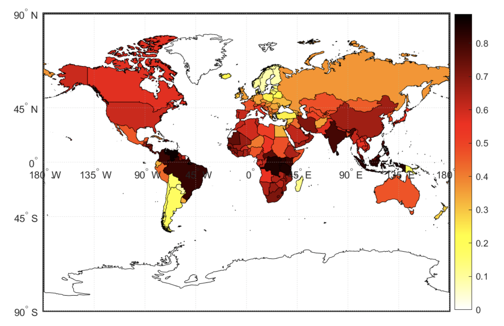
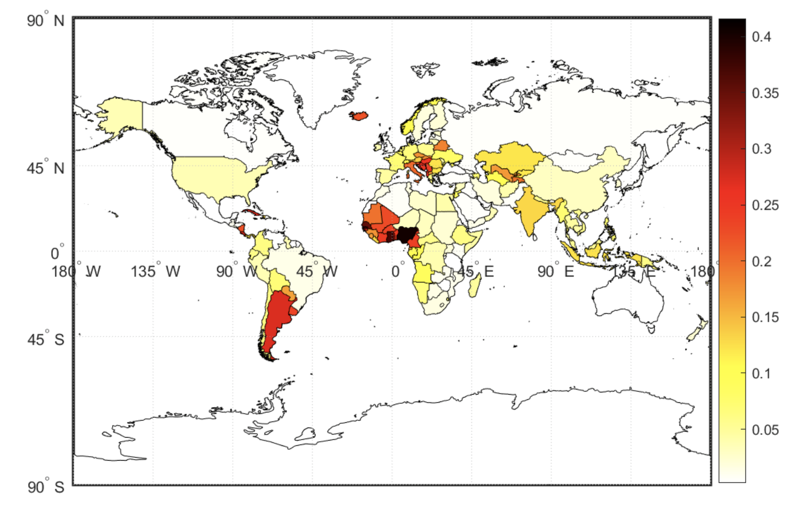

# Vulnerability to Climate Change: Evidence from a Dynamic Factor Model
<b>Fulvia Marotta and Haroon Mumtaz</b>

We construct country-year-specific indicators of vulnerability to global warming using a dynamic factor model with stochastic volatility. The model allows us to: 1)  quantify the extent of the increase in global temperatures, 2) offers a unique measure of how each country’s temperatures align with this common global movement. The model is estimated with Bayesian techniques for a sample of 166 countries between 1923 and 2020. 

The paper is available [HERE](A_factor_model_for_temperatures_and_precipitations.pdf)

The data on the contribution of the temperature world factor to the country-specific temperature volatility is available [HERE](contr_w_factor.xlsx). 

Cite as: Mumtaz, Haroon, and Fulvia Marotta. Vulnerability to Climate change. Evidence from a dynamic factor model. No. 961. Queen Mary University of London, School of Economics and Finance, 2023.

Figure 1: Contribution of the world factor to temperature volatility, average across time.

Figure 2: Contribution of the world factor to precipitation volatility, average across time.

